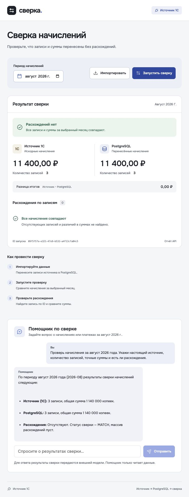
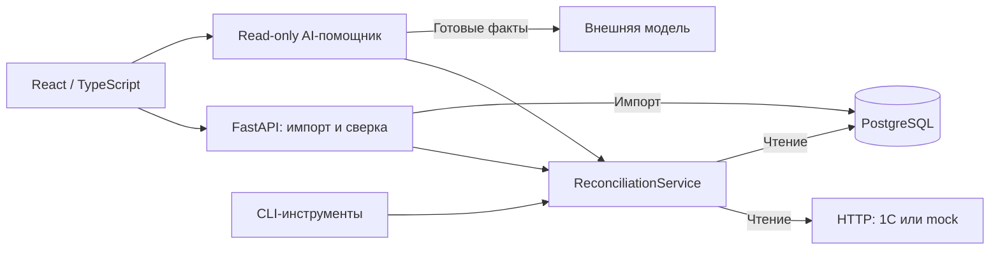

# Sverka

### Сверка данных 1С и PostgreSQL с AI-помощником

Full-stack проект для контроля переноса данных: импорт лицевых счетов, начислений
и платежей из 1С, сравнение начислений за выбранный месяц и объяснение расхождений.
Проверки и суммы вычисляет Python; модель получает готовый отчёт через инструменты
только для чтения.

**React · TypeScript · FastAPI · PostgreSQL · 1С · Docker Compose**

[Быстрый запуск](#быстрый-запуск) · [Демонстрация](docs/DEMO.md) ·
[Архитектура](docs/ARCHITECTURE.md) · [Проверки](docs/VALIDATION.md)

<details>
<summary><strong>Посмотреть интерфейс</strong> — сохранённый прогон с настоящей 1С, 02.10.2026</summary>



</details>

## Что умеет проект

- **Импортировать данные из 1С по HTTP.** Сохраняются ID, связи и точные суммы
  в целых копейках; повторный импорт не создаёт дубли.
- **Сверять начисления за месяц.** Отчёт содержит ID запуска, статус, количество
  и суммы по источникам, отсутствующие записи и различия в суммах или лицевом счёте.
- **Объяснять результаты.** CLI-агент и веб-помощник используют общий сервис
  сверки. Ключ модели остаётся на сервере, у роли агента нет прав записи в таблицы.
- **Проверять ошибки и расхождения.** Недоступный источник не превращается в
  успешный пустой отчёт. Демосценарий воспроизводит MATCH → MISMATCH → MATCH.
- **Расширять валидацию.** Новые правила подключаются через реестр функций,
  не требуя переписывать импорт. В репозитории есть два предметных skill.

## Как это устроено



| Решение | Зачем оно нужно |
|---|---|
| Целые копейки | Точная арифметика без ошибок двоичного float |
| Транзакция и upsert | Атомарный импорт и повторный запуск без дублей |
| Общий сервис сверки | Одинаковые правила для API, UI и CLI-агента |
| Отдельный образ агента и роль `agent_reader` | Реквизиты импортёра не попадают в среду агента |
| Проверка контракта до записи | Некорректные ID, ссылки и суммы отклоняются до импорта |

Подробности: [архитектура](docs/ARCHITECTURE.md),
[права агента](docs/AGENT_DESIGN.md), [контракт](CONTRACT.md).

## Быстрый запуск

Демо работает без установленной 1С и без ключа модели: по умолчанию используется
**HTTP mock с синтетическими данными**. Это самостоятельный демонстрационный режим,
а не подтверждение интеграции с настоящей 1С.

Нужны Git, Docker Engine/Desktop с Compose v2 и Python 3.
Команды рассчитаны на macOS/Linux или WSL; Docker должен быть запущен.

```bash
git clone https://github.com/xtwze/TestFullstack.git
cd TestFullstack
python3 scripts/setup_local.py
COMPOSE_BAKE=false DOCKER_BUILDKIT=0 docker compose up -d --build --wait
```

Скрипт создаёт локальный `.env` и случайный пароль импортёра, сохраняя существующие
настройки. Если используете уже настроенный checkout, проверьте `ONEC_BASE_URL`:
непустое значение включает реальный источник. Классическая сборка используется
для совместимости с кириллицей в пути.

Откройте **[localhost:5173](http://localhost:5173)**:

1. Нажмите **«Импортировать»**.
2. Выберите **август 2026** и нажмите **«Запустить сверку»**.
3. Проверьте **MATCH**, по **3 начисления** и **1 140 000 копеек** в обоих источниках.

[API / OpenAPI](http://localhost:8080/docs) ·
[API агента](http://localhost:8081/docs)

Команды проверки источника, повторного импорта, внесения и восстановления
расхождений — в [руководстве по демонстрации](docs/DEMO.md).

### Включить AI-помощника

Добавьте ключ RouterAI в `LLM_API` локального `.env` и примените настройки:

```bash
docker compose up -d --wait agent
```

Пример вопроса: **«Сверь начисления за август 2026 года и объясни расхождения»**.
Без ключа импорт и сверка доступны, но чат не работает. При обращении в чат
результаты инструментов передаются внешней модели; ключ в браузер не отправляется.

### Подключить настоящую 1С

В репозитории есть минимальная конфигурация XML/BSL, загрузка фикстур и инструкция
восстановления публикации. Нужен официальный дистрибутив платформы, который
не входит в репозиторий. Порядок сборки и подключения:
[1С в Linux/Docker](onec/linux/README.md).

## Проверки и доказательства

Зафиксированный прогон **02.10.2026**: **57 Python-тестов**, **8 frontend-тестов**,
Ruff и production-сборка прошли. Полный Python-прогон использует отдельную
одноразовую PostgreSQL; без неё два интеграционных теста пропускаются.

- [Протокол проверок и ограничения](docs/VALIDATION.md).
- [Настоящая 1С: импорт, права, MATCH → MISMATCH → MATCH](docs/evidence/real-1c-run.json).
- [Вопрос CLI-агенту, вызов инструмента и объяснение MISMATCH](docs/evidence/agent-mismatch-real.json).
- [Отдельный mock-прогон](docs/evidence/mock-run.json).

Для запуска проверок на хосте нужны uv, Python 3.12+ и Node.js 22.12+ с npm.
Все команды выполняются из корня репозитория:

```bash
uv sync --frozen
uv run ruff check source tests scripts
uv run python scripts/test_postgres.py
(cd frontend && npm ci && npm test && npm run build)
```

## Границы демо

Проект предназначен для локальной демонстрации на синтетических данных.
Построчная сверка реализована для **начислений**; для платежей доступна сводка
количества и суммы. Авторизация пользователей, CDC и бухгалтерские проводки
не реализованы.

Ограничения агента обеспечиваются списком инструментов и правами БД, но не являются
sandbox для владельца хоста с доступом к Docker или произвольному shell.
Учебная публикация 1С доступна только локально; особенности её прав описаны
в инструкции. Секреты, установщики, лицензии и локальные базы не входят в Git.

## Навигация по репозиторию

| Путь | Содержимое |
|---|---|
| `source/` | API, доменная логика, импорт, репозитории, CLI и агент |
| `frontend/` | React-интерфейс и Nginx |
| `onec/` | Конфигурация и инструкции по запуску 1С |
| `fixtures/` | Синтетические данные |
| `tests/` | Проверки поведения и интеграции |
| `scripts/` | Подготовка окружения, демонстрация и тестовые сценарии |
| `skills/` | Валидация источника и проверка отчёта |
| `docs/` | Архитектура, руководство и сохранённые протоколы |

[Добавление правил](docs/RULES.md) · [Использование AI при разработке](AI_USAGE.md)
